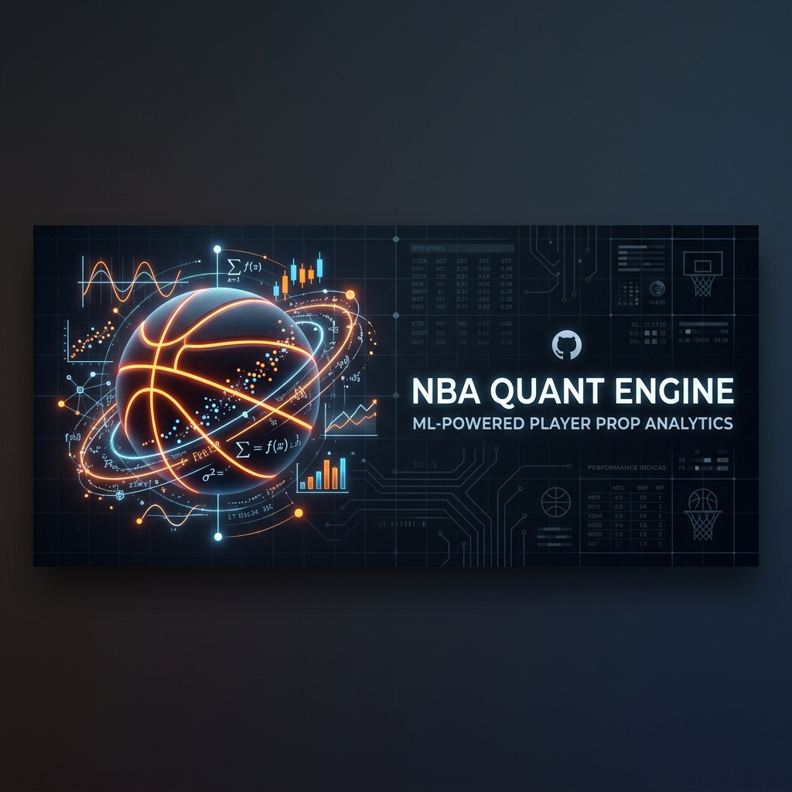

<p align="center">
  
</p>

<h1 align="center">🏀 NBA Quantitative Analytics Engine</h1>

<p align="center">
  <em>A professional-grade, ML-powered player prop prediction system that systematically identifies market inefficiencies in NBA betting lines.</em>
</p>

<p align="center">
  
  
  
  
</p>

<p align="center">
  
  
  
  
  
</p>

---

## 📖 Overview

This engine combines **deep contextual NBA data** — referee whistle tendencies, jet-lag fatigue, shot-chart spatial matchups — with a **stacked ensemble ML architecture** (Optuna-optimized XGBoost + LightGBM) to project player performance with surgical precision.

It then compares those projections against live sportsbook lines to surface **+EV (positive expected value)** betting opportunities that the market has mispriced.

### 🏆 Headline Results

| Metric | Value |
|--------|-------|
| **Overall Win Rate** | 64.03% |
| **Overall ROI** | +22.24% |
| **Total Bets Backtested** | 7,743 |
| **Seasons Tested** | 2 (2024-25, 2025-26) |
| **Breakeven Threshold** | 52.38% (standard -110 juice) |
| **Edge Over Breakeven** | +11.65 percentage points |

> **UNDER bets** hit at **65.88%** — the model is especially strong at identifying when Vegas *overvalues* a player's scoring line.

---

## 🏗️ Architecture

```
┌──────────────────────────────────────────────────────────────────┐
│                    NBA QUANT ENGINE v2.0                         │
├──────────────────────────────────────────────────────────────────┤
│                                                                  │
│  ┌─────────────┐   ┌──────────────────┐   ┌──────────────────┐  │
│  │  Data Layer  │   │  Feature Engine   │   │   ML Pipeline    │  │
│  │             │   │                  │   │                  │  │
│  │ • nba_api   │──▶│ • EMA (3/7/15)   │──▶│ • XGBoost        │  │
│  │ • Odds API  │   │ • Volatility     │   │   (Optuna-tuned) │  │
│  │ • Playwright│   │ • Rest Days      │   │ • LightGBM       │  │
│  │   Scraper   │   │ • Career Baseline│   │ • Stacked        │  │
│  │             │   │ • Minutes Ratio  │   │   Ensemble Avg   │  │
│  └─────────────┘   └──────────────────┘   └────────┬─────────┘  │
│                                                     │            │
│  ┌─────────────────────────────────────┐           │            │
│  │       Deep Context Matrix           │           │            │
│  │                                     │           ▼            │
│  │ • Opponent Def Rating (10-game)     │   ┌──────────────────┐ │
│  │ • Positional Defense Mapping        │   │  Monte Carlo     │ │
│  │ • Pace Factor                       │──▶│  Simulator       │ │
│  │ • Opponent FTA Rate (Foul Risk)     │   │  (10,000 sims)   │ │
│  │ • Referee Whistle Modifier          │   └────────┬─────────┘ │
│  │ • Travel Fatigue (miles + tz)       │            │           │
│  │ • Shot Chart Spatial Matchup        │            ▼           │
│  └─────────────────────────────────────┘   ┌──────────────────┐ │
│                                            │  Market Engine   │ │
│  ┌─────────────────────────────────────┐   │                  │ │
│  │       Live Modifiers                │──▶│ • +EV Detection  │ │
│  │                                     │   │ • Blowout Penalty│ │
│  │ • Injury Scraper (Playwright)       │   │ • Usage Shifts   │ │
│  │ • Blowout Risk (spread > 12.0)      │   │ • PRA Cheat Sheet│ │
│  │ • Usage Rate Redistribution         │   └──────────────────┘ │
│  └─────────────────────────────────────┘                        │
│                                                                  │
└──────────────────────────────────────────────────────────────────┘
```

---

## 📂 Project Structure

```
nba_quant_engine/
├── 📄 README.md                   # You are here
├── 📄 LICENSE                     # MIT License
├── 📄 requirements.txt            # Python dependencies
├── 📄 .gitignore                  # Git ignore rules
├── 📄 .env.example                # Environment variable template
│
├── 🗄️ Core Pipeline
│   ├── database.py                # SQLAlchemy engine setup
│   ├── schema.py                  # ORM models (Player, Game, Logs, etc.)
│   ├── init_db.py                 # Database initialization
│   ├── ingest_nba_api.py          # NBA API data ingestion (multi-season)
│   └── ingest_player_props.py     # The Odds API live line scraper
│
├── ⚙️ Feature Engineering
│   ├── feature_engineering.py     # EMA, volatility, rest days, baselines
│   ├── build_ultimate_context.py  # Minutes ratio, career baselines
│   ├── add_opponent_defense.py    # Opponent defensive ratings & matchups
│   └── deep_data_engine.py        # Referee, travel fatigue, shot chart features
│
├── 🧠 Machine Learning
│   ├── train_model.py             # XGBoost P/R/A model training
│   ├── hyper_tuner.py             # Optuna Bayesian hyperparameter search
│   ├── ensemble_model.py          # Stacked Ensemble (XGBoost + LightGBM)
│   └── models/                    # Saved .joblib model files
│
├── 📊 Prediction & Execution
│   ├── market_engine.py           # Live cheat sheet generator + Monte Carlo
│   ├── predict_tomorrow.py        # Tomorrow's game predictions (wrapper)
│   ├── backtester.py              # Multi-season walk-forward backtester
│   └── injuries.json              # Live injury configuration
│
├── 🕵️ Intelligence
│   ├── injury_scraper.py          # Headless Playwright X/Twitter scraper
│   └── deep_data_research.py      # Research utilities
│
├── 🎨 Assets
│   └── assets/                    # Banner images, diagrams
│
└── 🤖 CI/CD
    └── .github/
        └── workflows/
            └── daily_predictions.yml  # Nightly GitHub Action
```

---

## 🛠️ End-to-End Setup Plan

Welcome to the NBA Quant Engine. Please note: **This system requires a full historical data load and model training on your first run.** We do not ship the SQLite database or trained models in the repository to keep it lightweight.

### Prerequisites

- Python 3.12+
- A free API key from [The Odds API](https://the-odds-api.com/) (required for live lines and predictions)

### 1. Installation

```bash
# Clone the repository
git clone https://github.com/Shrey6876/nba-quant-engine.git
cd nba-quant-engine

# Create & activate virtual environment
python3 -m venv venv
source venv/bin/activate    # macOS/Linux
# .\venv\Scripts\activate   # Windows

# Install Python dependencies
pip install -r requirements.txt

# Install Playwright browser (needed for injury scraper)
playwright install chromium

# Set up environment variables
cp .env.example .env
# IMPORTANT: Edit .env and add your ODDS_API_KEY
```

### 2. First Run (Data Ingestion & Training)

**⚠️ Warning:** The initial run will fetch thousands of historical games from the `nba_api`. This process may take 10-20 minutes depending on your internet connection and API rate limits.

```bash
# Step 1: Initialize the database & ingest historical data
python init_db.py
python ingest_nba_api.py

# Step 2: Build the deep feature matrix
python feature_engineering.py
python add_opponent_defense.py
python build_ultimate_context.py
python deep_data_engine.py

# Step 3: Train the Machine Learning models
# This will create a models/ directory and save .joblib files
python train_model.py
```

### 3. Daily Usage (Getting Tomorrow's Predictions)

Once the initial setup is complete, you only need to run the daily update scripts. Our ingestion scripts are **incremental** — they will only fetch games that have occurred since your last run.

```bash
# Activate the environment
source venv/bin/activate

# 1. Update the database with last night's games (Incremental)
python ingest_nba_api.py

# 2. Rebuild the latest features for the new games
python feature_engineering.py
python add_opponent_defense.py
python build_ultimate_context.py
python deep_data_engine.py

# 3. Pull latest injury news from X/Twitter
python injury_scraper.py

# 4. Fetch real sportsbook lines for tomorrow's games
python ingest_player_props.py

# 5. Generate tomorrow's player prop projections
python predict_tomorrow.py
```

*Pro Tip: You can create a shell alias to run the daily usage commands with a single word.*

---

## 📈 Backtest Results

The engine uses **walk-forward validation** — training only on past data and testing blindly on each subsequent season:

| Season | Training Games | Test Games | Bets Placed | Win Rate | ROI |
|--------|---------------|------------|-------------|----------|-----|
| 2024-25 | 12,308 | 14,629 | 3,852 | **64.25%** | **+22.66%** |
| 2025-26 | 26,937 | 14,749 | 3,891 | **63.81%** | **+21.82%** |
| **Combined** | — | **29,378** | **7,743** | **64.03%** | **+22.24%** |

### Bet Type Breakdown

| Bet Type | Count | Win Rate |
|----------|-------|----------|
| OVER | 3,447 | 61.73% |
| UNDER | 4,296 | **65.88%** |

---

## 🔬 Feature Matrix (18 Dimensions)

| # | Feature | Category | Description |
|---|---------|----------|-------------|
| 1 | `pts_ema_3` | Momentum | 3-game exponential moving average (points) |
| 2 | `pts_ema_7` | Momentum | 7-game EMA |
| 3 | `pts_ema_15` | Momentum | 15-game EMA |
| 4 | `reb_ema_7` | Momentum | 7-game rebounds EMA |
| 5 | `ast_ema_7` | Momentum | 7-game assists EMA |
| 6 | `min_ema_7` | Workload | 7-game minutes EMA |
| 7 | `pts_volatility_10` | Risk | 10-game scoring standard deviation |
| 8 | `days_rest` | Fatigue | Calendar days since last game |
| 9 | `pts_career_baseline` | Identity | Career scoring average (anchor) |
| 10 | `expected_minutes_ratio` | Role | Recent minutes ÷ career minutes |
| 11 | `opp_def_rating_10` | Matchup | Opponent's 10-game defensive rating |
| 12 | `pos_def_rating_10` | Matchup | Position-specific defensive rating |
| 13 | `opp_pace_10` | Tempo | Opponent's 10-game pace factor |
| 14 | `opp_fta_rate_10` | Foul Risk | Opponent FTA rate (foul-drawing tendency) |
| 15 | `referee_whistle_modifier` | Deep | Crew-specific foul-calling tendency |
| 16 | `miles_traveled_since_last_game` | Deep | Geodesic miles flown between arenas |
| 17 | `time_zones_crossed` | Deep | Absolute time zone differential |
| 18 | `spatial_matchup_rating` | Deep | Player hot-zone vs. opponent cold-zone overlap |

---

## ⚙️ Configuration

### `injuries.json`

Flag players as injured to trigger automatic usage-rate redistribution:

```json
{
  "injuries": [
    {
      "player": "LeBron James",
      "team": "Los Angeles Lakers",
      "status": "OUT",
      "usage_beneficiaries": ["Anthony Davis", "Austin Reaves"]
    }
  ]
}
```

### `.env`

```env
ODDS_API_KEY=your_api_key_here
DATABASE_URL=sqlite:///./nba_quant.db
```

---

## 🤖 GitHub Actions (Automated Daily Predictions)

The included workflow (`.github/workflows/daily_predictions.yml`) runs every morning at 10:00 AM UTC:

1. Sets up the Python environment
2. Runs the injury scraper for latest news
3. Generates tomorrow's projections
4. Uploads `predictions.txt` as a downloadable artifact

You can also trigger it manually from the **Actions** tab.

---

## 🛡️ Disclaimer

> This project is for **educational and research purposes only**. Sports betting involves financial risk. Past backtested performance does not guarantee future results. Always gamble responsibly and within your means.

---

## 📜 License

This project is licensed under the MIT License — see the [LICENSE](LICENSE) file for details.

---

<p align="center">
  Built with ☕ and 🏀 by <a href="https://github.com/shreyjain">shreyjain</a>
</p>
